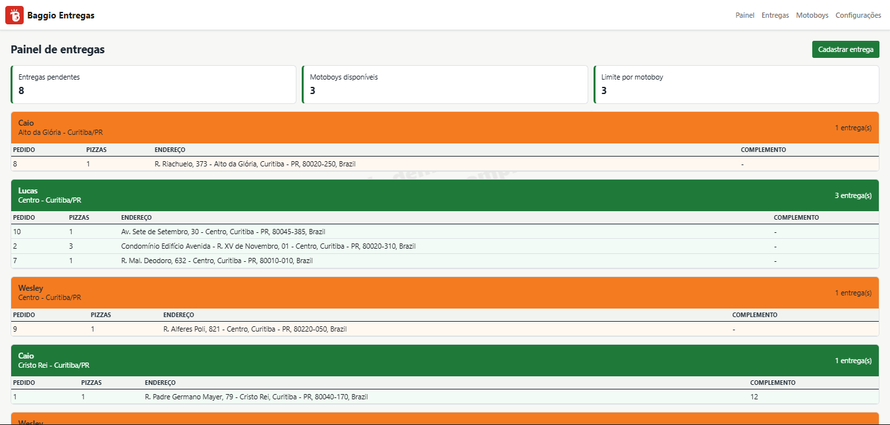
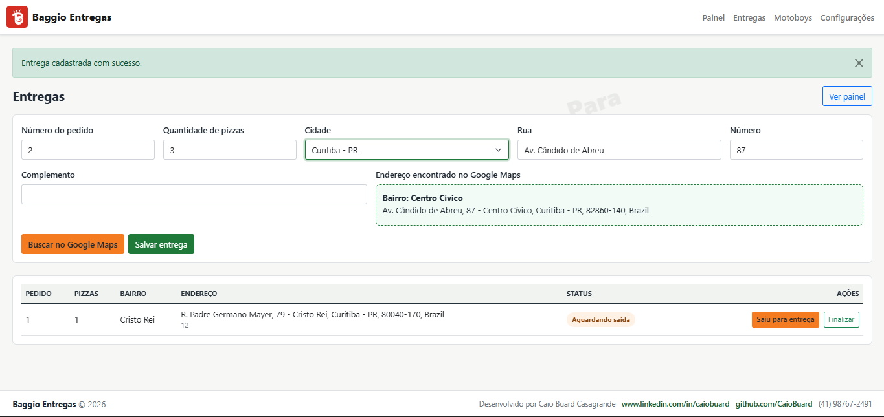
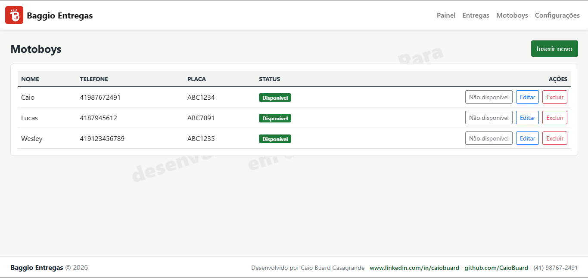

# Sistema Pizzaria Demo

Aplicação web interna para gestão de entregas de uma pizzaria, criada em ASP.NET Core MVC com banco de dados MySQL. O sistema permite cadastrar motoboys, registrar entregas, consultar endereços no Google Maps, acompanhar entregas pendentes em painel operacional e configurar o limite máximo de entregas por motoboy.

> Projeto de demonstração. Para usar em produção, revise segurança, autenticação, permissões, logs e política de secrets.

## Funcionalidades

- Cadastro de motoboys com nome, telefone, placa e disponibilidade.
- Exclusão lógica de motoboys, mantendo o registro no banco como inativo.
- Cadastro de entregas com número do pedido, quantidade de pizzas e endereço.
- Consulta de endereço exclusivamente pela Google Maps Geocoding API.
- Controle de status da entrega: aguardando saída, saiu para entrega e finalizada.
- Painel de entregas pendentes agrupado por bairro.
- Distribuição automática por motoboy disponível, respeitando o limite configurado.
- Alternância visual das cores dos grupos em laranja e verde.
- Página simples de configurações com limite máximo de entregas por motoboy.
- Marca d'água de demonstração e rodapé com informações de contato.

## Tecnologias

- .NET 8
- ASP.NET Core MVC
- Entity Framework Core
- Pomelo.EntityFrameworkCore.MySql
- MySQL
- Razor Views
- Bootstrap
- xUnit

## Requisitos

- .NET SDK 8
- MySQL 8 ou compatível
- Uma chave da Google Maps Platform com a Geocoding API habilitada

## Configuração Local

O arquivo `appsettings.json` fica no repositório com valores seguros de exemplo. Segredos locais devem ficar em `SistemaPizzariaDemo/appsettings.Local.json`, que está no `.gitignore` e não deve ser commitado.

Crie o arquivo `SistemaPizzariaDemo/appsettings.Local.json` com este formato:

```json
{
  "ConnectionStrings": {
    "DefaultConnection": "Server=localhost;Port=3306;Database=pizzaria_demo;User=root;Password=SUA_SENHA;"
  },
  "GoogleMaps": {
    "ApiKey": "SUA_CHAVE_GOOGLE_MAPS"
  }
}
```

## Banco de Dados

Restaure as ferramentas locais do projeto:

```powershell
dotnet tool restore
```

Crie ou atualize o banco com as migrations:

```powershell
dotnet tool run dotnet-ef database update --project .\SistemaPizzariaDemo\SistemaPizzariaDemo.csproj --startup-project .\SistemaPizzariaDemo\SistemaPizzariaDemo.csproj
```

## Executando

Restaure os pacotes e rode a aplicação:

```powershell
dotnet restore
dotnet run --project .\SistemaPizzariaDemo\SistemaPizzariaDemo.csproj
```

Acesse a URL exibida no terminal, por exemplo:

```text
http://localhost:5055
```

## Testes

Execute a suíte de testes:

```powershell
dotnet test .\SistemaPizzariaDemo.sln
```

Os testes cobrem regras de agrupamento de entregas, capacidade por motoboy, alternância de cores e exclusão lógica de motoboys.

## Estrutura Principal

```text
SistemaPizzariaDemo/
  Controllers/
  Data/
  Migrations/
  Models/
  Options/
  Services/
  ViewModels/
  Views/
  wwwroot/
SistemaPizzariaDemo.Tests/
docs/screenshots/
```

## Fluxo de Uso

1. Cadastre os motoboys.
2. Marque quais motoboys estão disponíveis.
3. Cadastre entregas informando pedido, quantidade de pizzas e endereço.
4. Use a busca no Google Maps para preencher bairro e endereço normalizado.
5. Abra o painel para visualizar entregas pendentes agrupadas por bairro e distribuídas por motoboy.
6. Marque a entrega como saiu para entrega.
7. Finalize a entrega quando concluída.
8. Ajuste o limite máximo de entregas por motoboy em Configurações.

## Imagens do Sistema

### Painel de Entregas



### Cadastro de Entregas



### Cadastro de Motoboys



### Lista e Status das Entregas

Espaço reservado para anexar uma imagem da listagem com os botões de saída e finalização.

```markdown

```

### Configurações

Espaço reservado para anexar uma imagem da configuração de limite máximo de entregas por motoboy.

```markdown

```

## Observações de Segurança

- Não commit o arquivo `appsettings.Local.json`.
- Não commit chaves de API, senhas ou tokens.
- Restrinja a chave do Google Maps para uso apenas da Geocoding API.
- Em produção, restrinja a chave por IP do servidor.
- Para um ambiente real, adicione autenticação e controle de permissões.

## Autor

Desenvolvido por Caio Buard Casagrande.

- LinkedIn: [www.linkedin.com/in/caiobuard](https://www.linkedin.com/in/caiobuard)
- GitHub: [github.com/CaioBuard](https://github.com/CaioBuard)
- Telefone: (41) 98767-2491
